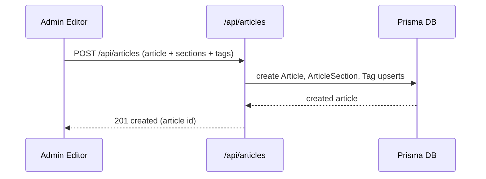

# Admin UI Guide

## Purpose & Audience
This document is an operator and developer guide for the Admin UI: how to use the admin pages (create/edit/publish content), common workflows, and where the relevant code lives.

- Audience: site administrators, content editors, and developers extending the Admin UI.

## Quick links to source
- Login page: [app/(admin)/login/page.tsx](app/(admin)/login/page.tsx)
- Admin layout: [app/(admin)/admin/layout.tsx](app/(admin)/admin/layout.tsx)
- Dashboard: [app/(admin)/admin/dashboard/page.tsx](app/(admin)/admin/dashboard/page.tsx)
- Article editor: [components/admin/editor/ArticleEditor.tsx](components/admin/editor/ArticleEditor.tsx)
- Article meta controls: [components/admin/ArticleMetaSidebar.tsx](components/admin/ArticleMetaSidebar.tsx)
- Media picker / upload: [components/admin/MediaPickerModal.tsx](components/admin/MediaPickerModal.tsx)
- Module form: [components/admin/ModuleForm.tsx](components/admin/ModuleForm.tsx)
- API endpoints for admin actions (examples): [app/api/articles/route.ts](app/api/articles/route.ts), [app/api/media/upload/route.ts](app/api/media/upload/route.ts)

## Roles & Authentication
- Roles: `ADMIN`, `SUPERADMIN` (defined in `prisma/schema.prisma`).
- Authentication entry-point: NextAuth configured under [app/api/auth/[...nextauth]/route.ts](app/api/auth/[...nextauth]/route.ts) and helpers in `lib/auth.ts`.
- Quick-login or seeded admin accounts may exist in `prisma/seed.ts` and `scripts/seed-hostinger.js`.

## Navigation overview
- Top-level admin pages are under `app/(admin)/admin/*`.
- Sidebar items (see `components/admin/Sidebar.tsx`) include: Dashboard, Articles, Modules, Topics, Media, Menus, Analytics, Settings.

## Common workflows
Each workflow lists: UI steps, relevant components, and API endpoints.

### 1) Create a new Article (editor workflow)
1. Open Admin → Articles → New: [app/(admin)/admin/articles/new/page.tsx](app/(admin)/admin/articles/new/page.tsx)
2. Authoring:
   - Use `ArticleEditor` (`components/admin/editor/ArticleEditor.tsx`) to add sections and rich content.
   - Add metadata in `ArticleMetaSidebar` (`components/admin/ArticleMetaSidebar.tsx`) — set `title`, `slug`, `summary`, `tags`, `menus` and publish status.
3. Media:
   - Upload/select images via `MediaPickerModal` (`components/admin/MediaPickerModal.tsx`), which calls `/api/media/upload`.
4. Save/Draft/Publish:
   - Save/Publish triggers the `app/api/articles` endpoints. See `POST` body shape in [app/api/articles/route.ts](app/api/articles/route.ts).

Mermaid sequence (Create Article):



Notes & tips:
- Slug uniqueness enforced by DB — the UI will try to derive the slug from title but handle collisions by editing it manually.
- Sections map to `ArticleSection` rows (see `prisma/schema.prisma`).

### 2) Publish scheduling
- In `ArticleMetaSidebar`, set `status` and `publishedAt`/`scheduledAt` fields. The API will respect `ArticleStatus` enum values: `DRAFT`, `SCHEDULED`, `PUBLISHED`, `ARCHIVED`.
- To publish immediately, set status to `PUBLISHED` and remove `scheduledAt`.

### 3) Linking an Article to menus/submenus
- Use `ArticleMetaSidebar` menu selectors to link articles to `NavMenu`/`NavSubMenu` entries; this creates `SubMenuArticle` join rows via the menus API.
- Menus and submenu management lives under `app/(admin)/admin/menus/*` and uses `app/api/menus/*` routes.

### 4) Media management
- Upload images via `MediaPickerModal` or `app/(admin)/admin/media` page.
- Upload endpoint: `/api/media/upload` — accepts multipart/form-data and returns `MediaAsset` with `url` and `id`.
- Reuse uploaded media by selecting items from the Media grid.

### 5) Topics & Modules
- Modules group topics. Create/modify via `ModuleForm` (`components/admin/ModuleForm.tsx`) and modules API.
- Topics are created under a module and linked to articles via `TopicArticle` join table.

## Troubleshooting & common fixes
- If Article slug collides: edit `slug` manually in metadata, then save.
- If media upload fails: check storage configuration (`lib/storage.ts`) and server logs. For local dev, ensure `NEXT_PUBLIC_UPLOAD_DIR` or storage backend is available.
- If migrations fail on deploy: verify DB backups (see `backups/`) and `prisma/migrations/*`. Follow rollback steps in `docs/Migrations-and-Deployments.md` (to be added).

## Quick commands for admins (dev environment)
Start dev server (example):

```bash
pnpm install
pnpm prisma migrate dev --name init
pnpm prisma db seed
pnpm dev
```

Use `prisma studio` to inspect data:

```bash
pnpm prisma studio
```

## Where to extend
- Add new admin pages under `app/(admin)/admin/*`.
- Reuse `AdminLayoutClient.tsx` and `Sidebar.tsx` for consistent navigation.
- For new editor features, extend `components/admin/editor/*` and ensure API handlers are present under `app/api/*`.

---

End of Admin UI guide (initial draft).