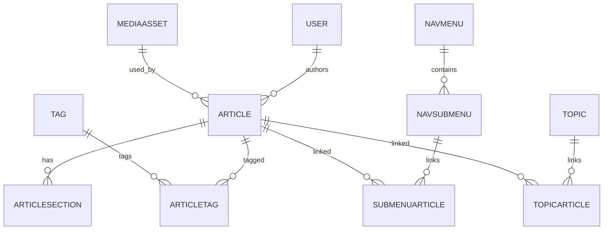

# Database Schema Reference

This document describes the Prisma models (tables), enums, and relationships used by the application. It is derived from `prisma/schema.prisma` and the current migrations.

## Enums
- `Role`: ADMIN, SUPERADMIN — user authorization levels.
- `ArticleStatus`: DRAFT, SCHEDULED, PUBLISHED, ARCHIVED — article lifecycle.
- `MediaType`: IMAGE, AUDIO, VIDEO, OTHER — media asset classification.
- `AILogType`: TEXT_GENERATION, IMAGE_GENERATION, AUDIO_GENERATION — AI usage categories.

## Models (summary)
Each model lists fields, types, notable constraints, and purpose.

### `User`
- id: Int @id @default(autoincrement())
- email: String @unique — used for login and notifications.
- passwordHash: String — bcrypt/argon hash for local accounts.
- name: String
- role: Role @default(ADMIN)
- createdAt: DateTime
- updatedAt: DateTime @updatedAt
- Relations: `articles`, `mediaAssets`, `aiLogs`
- Purpose: represents site administrators and authors.

### `Module`
- id, name, slug @unique
- order: Int
- description: String?
- icon: String?
- color: String?
- coverImage: String?
- isPublished: Boolean
- timestamps and createdBy/updatedBy (FKs to `User`)
- Relations: `topics`
- Purpose: top-level content grouping for navigation and content discovery.

### `Topic`
- id, moduleId -> Module
- name, slug @unique
- order, description, icon, color, isPublished
- Purpose: topics belong to modules and group related articles.

### `Article`
- id
- title: String
- slug: String @unique
- summary: String?
- status: ArticleStatus
- publishedAt: DateTime?
- scheduledAt: DateTime?
- isFeatured: Boolean
- coverImageId: Int? -> `MediaAsset`
- audioUrl: String?
- readingTimeMinutes: Int?
- viewCount: Int @default(0)
- seoTitle, seoDescription, canonicalUrl
- authorId -> `User`
- timestamps and createdBy/updatedBy
- Relations: `sections` (`ArticleSection[]`), `articleTags` (join to `Tag`), `topicArticles`
- Purpose: stores article metadata and relationships.

### `ArticleSection`
- id
- articleId -> `Article`
- title: String (default "")
- content: Text (rich HTML/MD content)
- order: Int
- Purpose: article body split into ordered sections (used by editor).

### `Tag` and `ArticleTag`
- `Tag`: id, name, slug (both unique)
- `ArticleTag`: join table (articleId, tagId) unique(articleId, tagId)
- Purpose: tag articles for discovery and filtering.

### `MediaAsset`
- id
- filename, url: String
- type: MediaType
- mimeType: String
- altText: String?
- caption: String?
- width, height: Int?
- sizeBytes: Int?
- aiPrompt: Text?
- createdByUserId -> `User`
- createdAt
- Purpose: store uploaded media metadata and references to object storage.

### `AIUsageLog`
- id
- userId? -> `User`
- articleId? -> `Article`
- type: AILogType
- model: String
- inputTokens, outputTokens: Int?
- promptSnippet: Text?
- status: String (default 'success')
- createdAt
- Purpose: audit for AI-generated content and cost tracking.

### `SiteSettings`
- id (singleton)
- siteName, tagline, logoUrl, faviconUrl
- metaDescription
- social links
- default OpenAI model and params
- updatedAt
- Purpose: single-row settings for the site.

### `NavMenu`, `NavSubMenu`, `SubMenuArticle`
- `NavMenu`: id, title, slug @unique, description, order, isVisible
- `NavSubMenu`: id, menuId -> NavMenu, title, slug @unique, order, isVisible
- `SubMenuArticle`: join table linking `NavSubMenu` and `Article` (orderIndex)
- Purpose: main navigation structure and article linking.

### `TopicArticle`
- join table linking `Topic` and `Article` (orderIndex)
- unique(topicId, articleId)

## Example queries
- Fetch an article with sections, tags, author and cover image:

```sql
SELECT a.*, s.*, t.*
FROM Article a
LEFT JOIN ArticleSection s ON s.articleId = a.id
LEFT JOIN ArticleTag at ON at.articleId = a.id
LEFT JOIN Tag t ON t.id = at.tagId
WHERE a.slug = 'your-article-slug';
```

- Prisma example (JS):

```js
const article = await prisma.article.findUnique({
  where: { slug: 'your-article-slug' },
  include: { sections: { orderBy: { order: 'asc' } }, articleTags: { include: { tag: true } }, author: true }
});
```

## Migration notes
See `prisma/migrations/*` for the actual DDL applied. Recent migrations added `ArticleSection` and normalized enums. Key migration files:
- `prisma/migrations/20260219170101_init/migration.sql`
- `prisma/migrations/20260223000000_add_article_sections/migration.sql`

## ER Diagram (Mermaid)



## Maintenance guidance
- Archive old articles by setting `status = 'ARCHIVED'` rather than deleting rows.
- Periodically prune `AIUsageLog` older than X months (business decision) to control table growth.
- Indexes: review heavy-read queries (article list, tag lookups) and add composite indexes if necessary.

---

End of Database Schema Reference (initial draft).